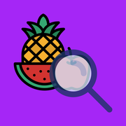
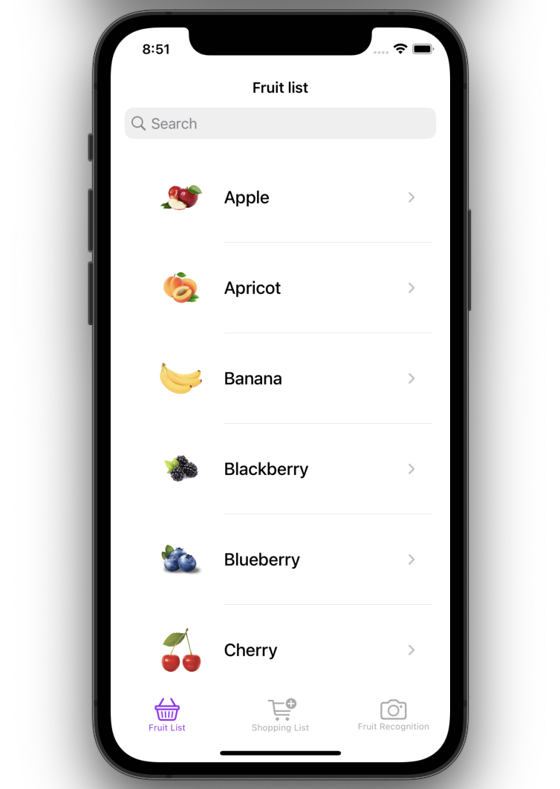
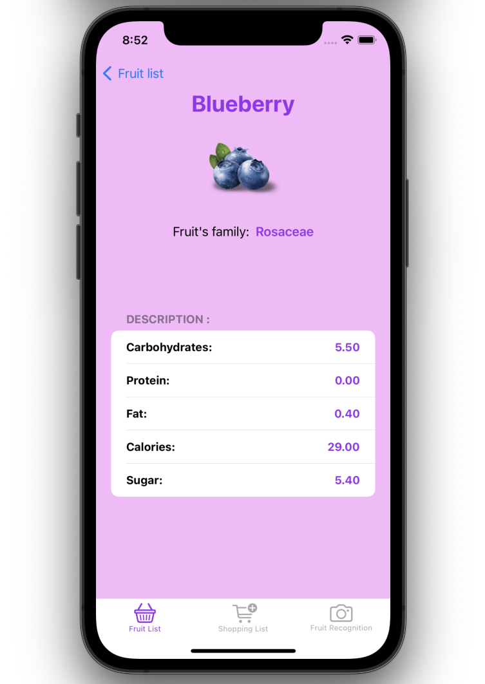
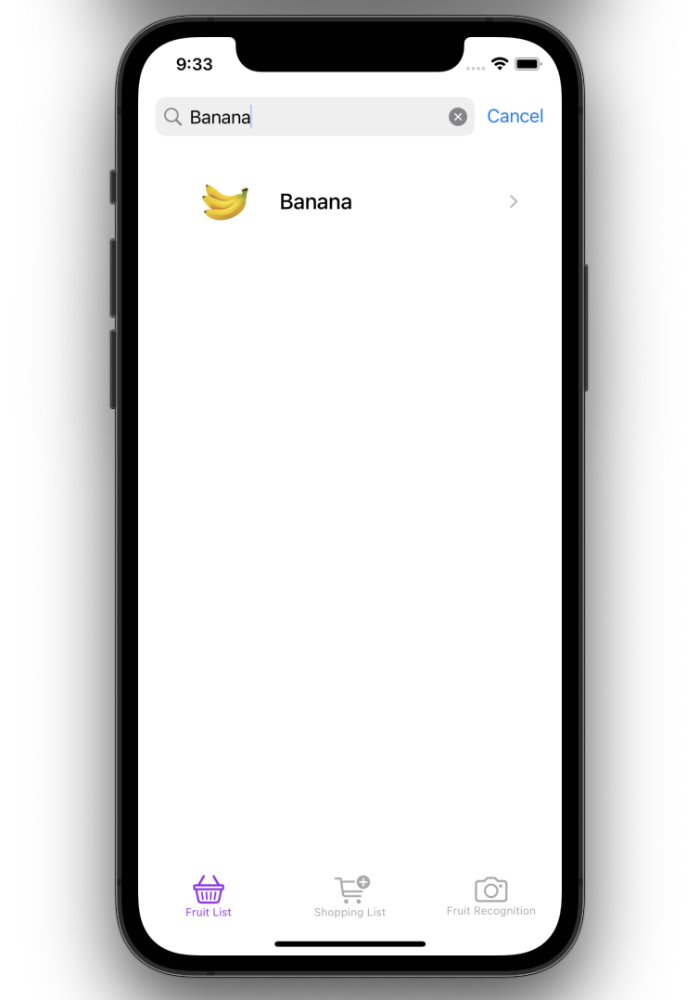
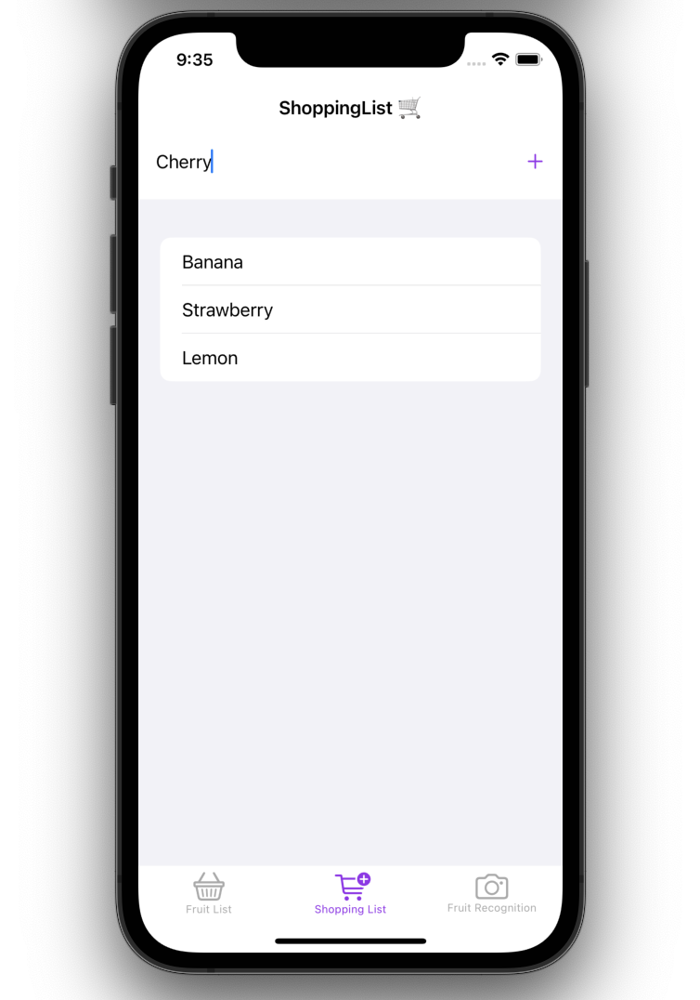
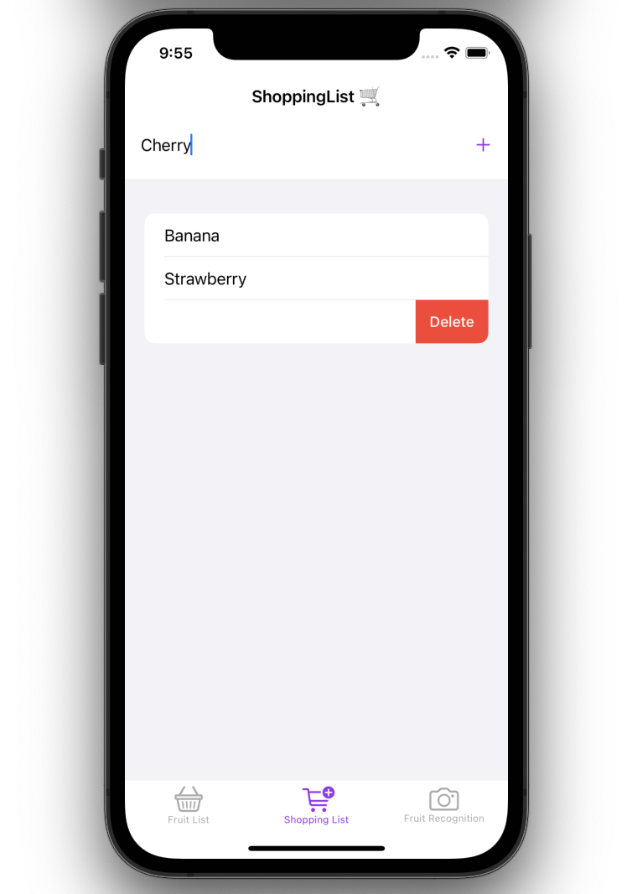
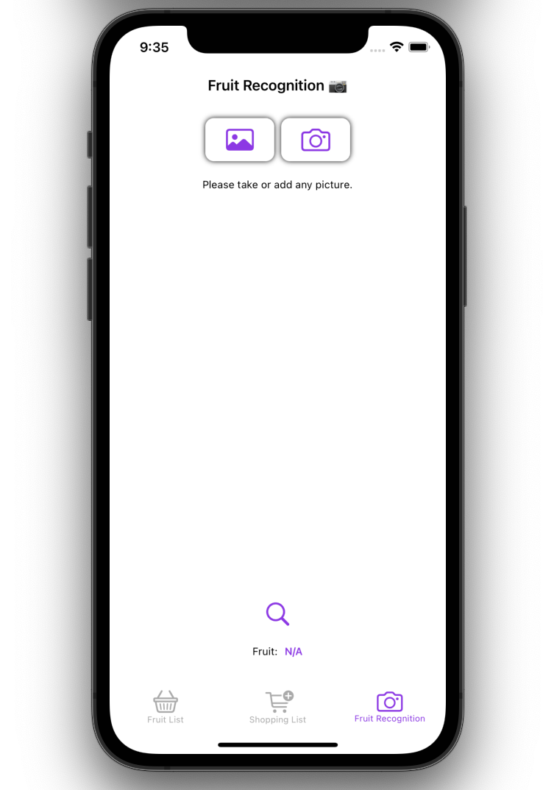
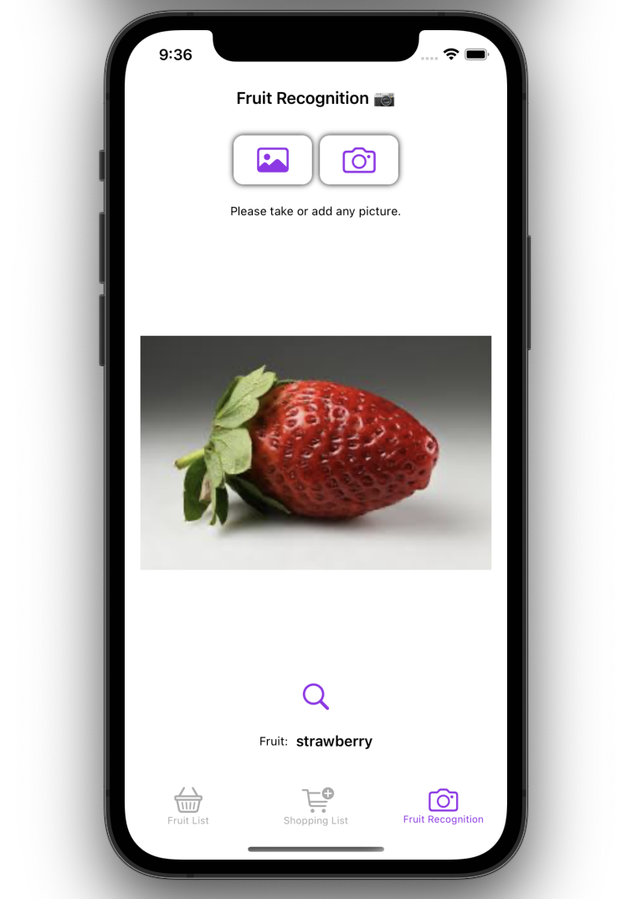

# 
 FruitSearcher 

  

FruitSearcher is an iOS application that retrieves a list of fruits, allow the user to interact with data such as a shopping, the fruit's list, and
can also interact with a fruit recognition coreML model that recognizes fruits.

## Fruit List
### Interact with the list
The user can interact with the list by clicking on one of the elements available on the interface.
Each time the user interact with an element, the background will display a different color. Just a little bit of fun right here :)

 

### Search bar
In addition to viewing a list of fruits, the app uses a search bar that allows the user to search for any type of fruit.

## Feature : Shopping list
### Add and Delete
The user is able to interact with another featuer, which is a shopping list. 
Any item can be added to a list, and can also be deleted at any time.

### Data registration
If the user quits the app and comes back, all the data will still remain in it.

## Feature : Fruit Recognition
### Add and Delete
The next and last feature grant the user to use **with his permission**, his photo library of camera to pick or take a picture of a fruit, and let the model recognizes the picture.

### AI Model Used
The coreML model used here is a model that I developed myself : **FruitClassifier**
